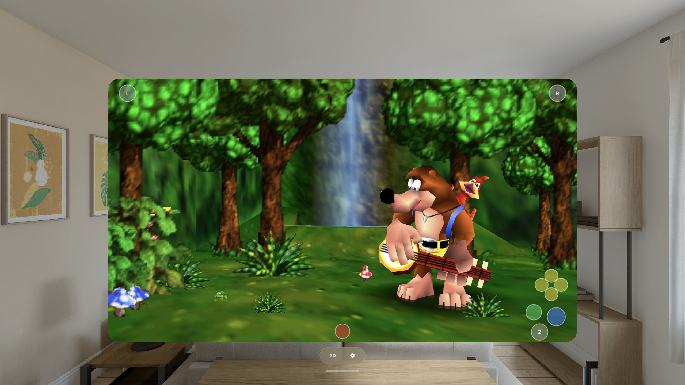

# Lighthouse for iPhone & Apple Vision Pro

Play **Banjo-Kazooie** on your iPhone and Apple Vision Pro — the full adventure with the
Lighthouse enhancements menu, the randomizer, online co-op, game controllers and a tunable
touch layout, and on Vision Pro a stereoscopic **3D mode** that puts Spiral Mountain on a
world-locked panel floating in your room with real depth.

Built on [Lighthouse](https://github.com/HarbourMasters/Lighthouse) (Harbour Masters'
native Banjo-Kazooie port) and
[libultraship](https://github.com/HarbourMasters/libultraship), rendering natively on
**Metal** — no translation layer. 100% vibe coded with lots of passion and attention
to detail.



*Banjo-Kazooie on Apple Vision Pro — a freely resizable window floating in your room,
rendering at true 4K, with the on-screen touch layout. The same build also runs in
stereoscopic 3D.*

---

## Install

**Add the SideStore source** — the easiest path, and the app auto-updates when new
versions ship:

| Device | Source URL |
| --- | --- |
| iPhone / iPad | `https://raw.githubusercontent.com/rebelancap/harbourmasters-ports/main/apps-ios.json` |
| Apple Vision Pro | `https://raw.githubusercontent.com/rebelancap/harbourmasters-ports/main/apps-visionos.json` |

In [SideStore](https://sidestore.io) / [AltStore](https://altstore.io): *Sources → **+** →
paste the URL*, then install Lighthouse. These are shared sources — they also carry
the other HarbourMasters ports as they ship.

**Getting SideStore onto your device** — on both platforms SideStore itself is installed
with **iloader**:

- **iPhone / iPad:** [iloader](https://github.com/nab138/iloader).
- **Apple Vision Pro:** my [iloader fork](https://github.com/rebelancap/iloader/releases#release-visionos) —
  upstream doesn't do visionOS. It runs on an Apple Silicon Mac and pairs with the headset
  over Wi-Fi: no cable, no Dev Strap, no Xcode.

Then add the source in SideStore exactly as above.

**Prefer a manual install?** Download `lighthouse-*-iOS.ipa` / `lighthouse-*-visionOS.ipa`
from the [latest release](../../releases/latest) and install it through SideStore/AltStore
yourself (iPhone can also use [Sideloadly](https://sideloadly.io)).

Then **add your Banjo-Kazooie ROM** — the app walks you through it on first launch.

## Texture packs

The port supports Harbour Masters' `.o2r` mods, and the one to get is
**[BK Reloaded](https://evilgames.eu/texture-packs/bk-reloaded.htm)** by GhostlyDark — the
same author as OoT Reloaded — a UHD texture pack in two flavours.

| Device | Recommended | Why |
| --- | --- | --- |
| **iPhone** | **HD** | Already out-resolves the phone's panel, and leaves the thermal headroom that keeps frame rates locked. On a phone-sized screen the 4K pack costs memory and heat for detail you cannot see. |
| **Apple Vision Pro** | **4K** | The headset renders at a far higher effective resolution and has the GPU headroom to spend. This is where the larger pack earns its size. |

- **Pack page & downloads:**
  [evilgames.eu/texture-packs/bk-reloaded.htm](https://evilgames.eu/texture-packs/bk-reloaded.htm)
- **Grab the `Lighthouse O2R` download** — `lh-o2r-hd` for iPhone, `lh-o2r-4k` for Vision
  Pro.

> **The pack is early — v0.2.1 is "UI only".** It currently replaces interface art, not
> the world. That is partly deliberate pacing by the author and partly an upstream limit:
> Banjo-Kazooie's model textures are bundled into the model data rather than addressed
> individually, so alternate-asset replacement cannot reach most in-world surfaces yet.
> Neither is an iOS limitation, and both improve as upstream and the pack progress —
> install it now and it gets better under you, but do not expect the transformation the
> equivalent packs deliver in the other ports.

**Installing:** extract the `.7z` on a computer, then copy the resulting `.o2r` into
*On My iPhone / Apple Vision Pro → Lighthouse → **mods*** in the Files app and relaunch.
The pack applies once **Enable Mods** is on (*Settings → Mod Menu → **Enable Mods*** in
the game's menu) — that's **on by default** on this build, so normally there is nothing to
do. Turn it off to compare against vanilla.

## Features

- The full adventure — every world, with saves, audio, music and cutscenes
- The **Lighthouse enhancements menu** — the reason these ports exist: higher frame
  rates, widescreen, and the whole quality-of-life catalogue
- The **randomizer** and **online co-op (Anchor)**, as shipped upstream
- **Presets** — save a whole set of enhancement/rando options under a name and
  reapply it in one tap (Settings → Presets)
- **ROM-hack support** — extract a Banjo's Backpack hack on the device itself and it
  installs as a mod overlay (custom MIPS code isn't extractable, so hacks that rely on
  it will be missing that behaviour). Needs a **US v1.0** base — see the FAQ
- **In-app ROM extraction** — no PC tools, no companion app
- **Game controllers** (Backbone, DualSense, Xbox…) with menu-aware navigation
- **Touch controls** built for an N64 platformer: floating analog stick, A/B, the four
  **C-buttons**, and **Z** with an optional double-tap to lock it held (Banjo holds Z
  constantly — crouch, Talon Trot, Wonderwing), plus a **layout customizer** — drag any
  button, scale the layout, left-handed mirror, opacity, haptics, and **per-button
  hide/show** so you can drop the buttons you never use
- **Hold A to fast-forward dialog**
- **60 / 120 Hz** (ProMotion) and a supersampling slider for extra sharpness
- Texture packs and other `.o2r` mods via drag-and-drop in Files
- On-screen fps + thermal readout for tuning
- **Apple Vision Pro:** a free-resizing 2D window rendering at true 4K, plus a
  **stereoscopic 3D mode** — the game on a world-locked panel floating in your room,
  with foveated rendering for full-resolution clarity where you're looking, spatial audio
  anchored to the screen, and live-tunable stereo depth, screen size/distance/height,
  surroundings dimming, and a recenter button. The panel resizes freely in both axes and
  the engine re-renders to match, so a wider screen shows more of the world rather than
  stretching it.

## Requirements

- iPhone on **iOS 15+**, or **Apple Vision Pro** (visionOS 2+)
- **SideStore**, installed with [iloader](https://github.com/nab138/iloader) — Apple Vision
  Pro needs my [visionOS fork](https://github.com/rebelancap/iloader/releases#release-visionos)
  and an Apple Silicon Mac
- Your own Banjo-Kazooie ROM (`.z64`)

## FAQ

**Do I need a PC to extract the ROM?** No — extraction runs inside the app on your device.

**Which ROM versions work?** US v1.0, US v1.1, Japan and PAL — any of the four for
playing the game.

**How do I add a ROM hack?** *Settings → Romhack Menu → **Generate Romhack from ROM***,
pick the hack's `.z64`, and it's extracted on the device into `mods/~romhacks/` as an
overlay on your existing game data. The app closes when it finishes so the mod loads on
the next launch, and you enable it from the same menu. Two things to know: hacks are
**extended ROMs** (larger than a 16 MB retail dump), and they are built against **US
v1.0** — so your `bk.o2r` has to come from a US v1.0 ROM or the hack won't play
correctly. The app tells you if your base is the wrong version. Hacks that ship custom
code will warn you before extracting: that code can't be extracted, so some of the
hack's behaviour will be missing.

**The app stopped launching after about a week?** Apps sideloaded with a free Apple
account expire after 7 days (paid developer accounts last a year). SideStore/iloader
refresh them automatically in the background — open the sideloading app and let it
re-sign.

**Found a bug, or it crashed?** The app keeps its own logs, and its folder is visible in
**Files** — open *On My iPhone / Apple Vision Pro → Lighthouse* and grab:

- `crash.txt` — a backtrace, written if the app died (this is the important one)
- `logs/` — the newest `.log` file

Attach those to a [GitHub issue](../../issues) or send them over Discord, along with what
you were doing and whether a texture pack was installed. A crash without `crash.txt` is
usually the app being killed for memory — worth saying so, and which world you were in.

---

## Building from source

Requires macOS with Xcode and `cmake` (`brew install cmake`).

```sh
scripts/bootstrap.sh          # clone + pin upstream Lighthouse (submodules recursive)
scripts/build-oracle.sh       # native macOS build — generates the asset archive
scripts/extract-bk-o2r.sh     # build bk.o2r from your ROM (for the simulator)

scripts/build-sim.sh          # iOS Simulator build
scripts/run-sim.sh            # install + launch + screenshot

scripts/build-ios.sh          # signed iPhone build
scripts/build-visionos.sh     # signed Apple Vision Pro build
```

Upstream Lighthouse is vendored **unmodified and pinned by commit**; every local change
is a reviewable patch in `overlay/patches/`, applied by `scripts/apply-overlay.sh` (a patch that fails to apply fails the build). The iOS/visionOS app shell lives in `app/ios/`.


## Credits & license

- [Lighthouse](https://github.com/HarbourMasters/Lighthouse) by **Harbour Masters**
  and contributors — the port this is built on
- [libultraship](https://github.com/HarbourMasters/libultraship) (MIT) and the Harbour
  Masters asset pipeline — the platform layer
- [BK Reloaded](https://evilgames.eu/texture-packs/bk-reloaded.htm) texture pack by
  **GhostlyDark**
- BANJO-KAZOOIE © **Nintendo** / **Rare**. This project is not affiliated with or endorsed
  by Nintendo or Rare, and ships no Nintendo or Rare content.

<!-- This repo's own code (the shell, the overlay generators, the scripts) is MIT —
     see LICENSE. Upstream Lighthouse ships no root LICENSE file and is unaffected by
     ours; libultraship is MIT and carries its own. The LICENSE was added in the 1.0.2
     public snapshot and back-filled into this dev repo afterwards. -->
